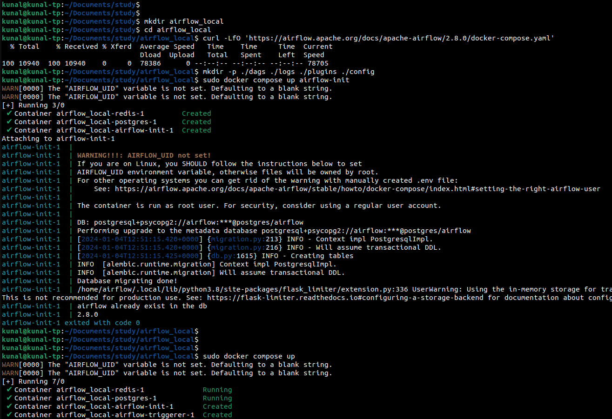
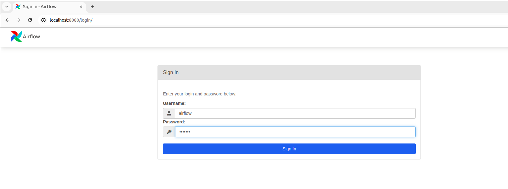
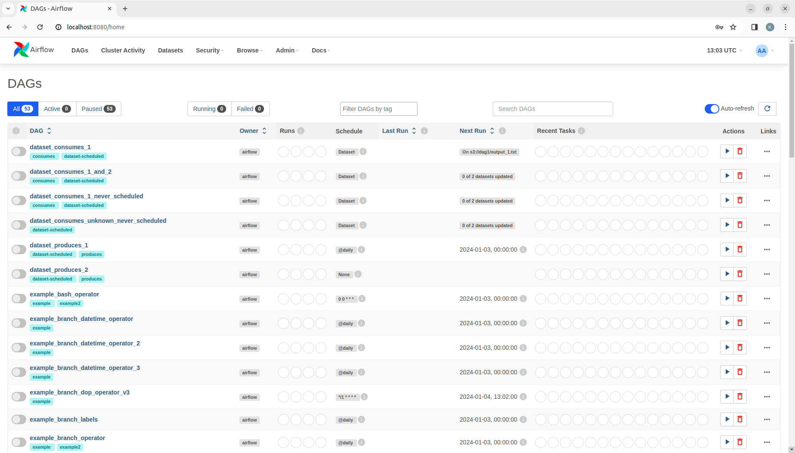

# Airflow Tutorial


## Introduction

- Airflow is a tool to programmatically define workflows, especially used for data engineering pipelines.  
- The workflows can be defined only using Python at this point.
- The workflows are created as DAGs, so that there is no ambiguity in execution.
- The DAGs can be triggered in the following ways:
  - By definining a schedule to run these on
  - Manually
  - Based on an external trigger. Ex. When data is loaded to a DB


## Installation

A basic non-robust and non-production-grade setup is quite simple using Docker via the following simple commands:
Note: You need to install curl and docker before running the following commands.  Here are the instructions to do that: https://github.com/2kunal6/util/blob/main/installations.txt
```
curl -LfO 'https://airflow.apache.org/docs/apache-airflow/2.8.0/docker-compose.yaml'
mkdir -p ./dags ./logs ./plugins ./config
sudo docker compose up airflow-init
sudo docker compose up
```

#### Notes
- Please use sudo for the docker command unless docker is configured to work as a non-root user.  More details here: https://docs.docker.com/engine/install/linux-postinstall/#manage-docker-as-a-non-root-user
- Without any modifications, you can view/manage the Airflow server now via http://localhost:8080
  - Please use username=airflow and password=airflow
- Now simply put your python dag files (which we will create subsequently) into the dags folder created above, and you will be able to view and run your dags.
- More details and other installation methods can be found here in this page https://airflow.apache.org/docs/apache-airflow/stable/howto/docker-compose/index.html

#### Why local installation?
It's a good idea to have a local installation done in our personal machines for faster POCs, although in the real world we will have to dedicate a cluster for Airflow for high availability and sharing.
- Local installation helps in faster POCs because with dedicated servers connected to production data it's easy to go wrong, or choke Spark servers if it's used to invoke Spark, if we are not careful.
- Moreover, if Airflow is hosted in AWS, then there would be some wait time for the code sync to happen through CI/CD to the S3 location from where the MWAA picks up for example.
- It also helps the team working on the same repo to not have to work through experimental changes.  We can commit only after a certain level of confidence in the code.






